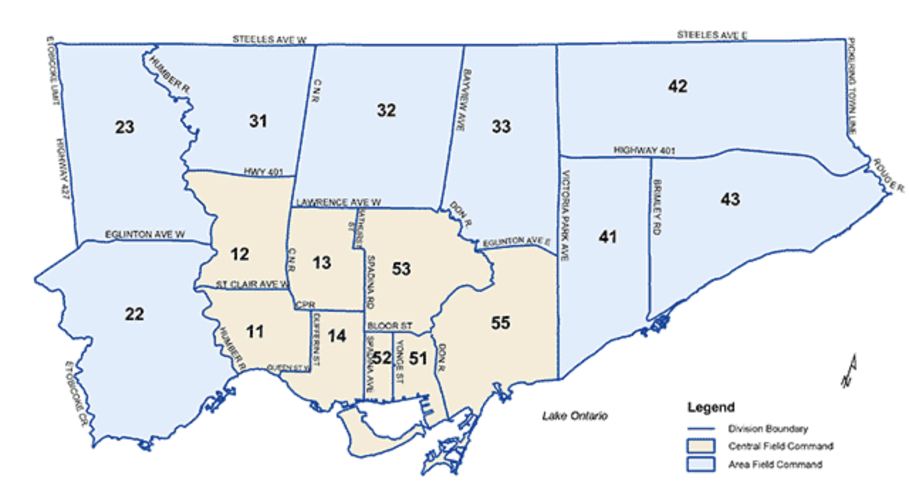

```{r setup, include=FALSE}
knitr::opts_chunk$set(echo = TRUE)
library(opendatatoronto)
library(tidyverse)
library(here)
shoot_clean <- read_csv(here("inputs/data/clean_shoot_data.csv")) 
  
```

# Introduction
In 1993-1994. The Bill Clinton administration launched the main political issues of its first term. During that time, he lobbied and signed gun control legislation known as the Brady Bill and the 1994 federal assault gun ban. Although the bill was initially considered a victory for Clinton and the Democrats in Congress, it has proved costly. Many accused Clinton of neglecting the focus on gun control.(Keneally, 2019)
As a neighbour of the United States, Canada, deeply influenced by American politics, followed suit and began a series of gun ban laws in 1995. Today, Canada's gun control law can be said to be the strictest in the world. However, contrary to expectations, the increasingly stringent gun control has led to a soaring number of shootings. Many people expressed doubts and puzzlement that the government has also ignored the key points in banning guns(Raycraft,2021).In this paper, I will investigate the total shootings received by various police divisions districts in Greater Toronto from 2014 to 2019. Find out the most and least affected communities and understand the causes of the shooting with the background of the community. As well as the shooting reports received in Greater Toronto every year from 2014 to 2019, explore the impact of these community at different time on the shooting. To ensure that the research is not tainted by any political correctness, it must be carefully checked against the larger context

# Data
To get a better sense of the impact of shootings on neighbourhoods over the years, I used data on shooting occurrences from the Toronto Open Data Portal (Gelfand 2020). This data was collected and released by the Toronto Police Department and was last updated on November 18, 2020. The data included 16 police divisions in the Greater Toronto area, each of which administered an area, and then included the number of shootings reported to each division in each year. Using R (R Core Team 2020), Tidyverse (Wickham et al.2019), I cleaned and extracted the necessary data to start the exploratory analysis.  

## Summary of shootings in each division
For the Total count of each division, I first selected the raw data of the division and the number of shootings each division received from 2014 to 2019. I'll focus on the division and put together a list of annual shooting occurrences. Combine all the cases into a long format data frame so that the number of cases can be added. 
```{r echo = FALSE}
#Total count of Division (Table)
shoot_clean |> 
  group_by(GeoDivision) |> 
  summarize(area_sum = sum(Count_))
```
To learn more about which neighbourhoods have the highest shooting rates and the year-over-year increase (Table 1). I present the data using ggplot2 (Wickham 2016) and sort the data according to the order of the divisions. I found that the data in various regions are uneven, and the number of cases in some communities is several times that in some communities (Figure 1), which is worthy of further exploration.
```{r out.width="80%", fig.cap="Total number of cases in each division from 2014 to 2019", fig.height=4, echo = FALSE}
#graph
shoot_clean |>     
  ggplot(mapping = aes(x = Count_, y = GeoDivision, fill = OccurredYear))+
  geom_bar(stat = "identity")

```

## Summary of shootings in each Year
After understanding the extent to which each community is affected by the shooting, we can take a look at the extent to which the Greater Toronto area as a whole is affected by the shooting. In the second part, in order to better understand the impact of the policy and time background of each year on the overall shooting cases in Greater Toronto, I selected the shooting cases received by each year and each division from 2014 to 2019 from the raw data. Group by year and put together all the shootings cases each division received. The influence of background on results was analyzed based on the total number of cases per year. By looking at (Tabel 2) The number of shootings in the greater Toronto area as a whole is consistent(Figure 2), which leads me to believe that it has a lot to do with context and policy.

```{r echo = FALSE}
#Total count of year Table    
shoot_clean |> 
  group_by(OccurredYear) |> 
  summarize(annual_sum = sum(Count_))
```

```{r out.width="80%", fig.cap="Total number of cases per year from 2014 to 2019", fig.height=4, echo = FALSE}
#bar graph
shoot_clean |>
  ggplot(mapping = aes(x = OccurredYear, y = Count_, fill = OccurredYear ))+
  geom_col(stat = "identity")+
  labs(title = "Total count of year")

```


# Results
Preliminary analysis showed that the 31 divisions topped the list several times as many as the other divisions(Figure 1). Combined with the number of each year, it has increased greatly. The highest total number of shootings proves that it seems to be a community with frequent shootings in Toronto, which is also consistent with the actual situation(Campbell,2020). It is understandable considering all aspects of information. The 31st Precinct, set in a high-density, multicultural and low-income neighbourhood, has a particularly tough gang problem(Friesen,2007). The 23 divisions came in second, which makes sense, given the complex nature of the area, with parts of it very safe and others extremely dangerous. In addition to the high incidence areas, I also analyzed the relatively safe areas. Through comparison, I found that there were only 53 cases in the 53 divisions because most areas of this division were very safe and there were almost no gangs stationed. Finally, we link the sum of all shooting cases with each year and find that the shooting rate is rising regularly from 2014 to 2019. As can be seen from Figure 1, the number of reports received by each police station almost keeps increasing every year. The overall number of cases in Greater Toronto has also increased from 177 in 2014 to 492 in 2019(Figure 2). I think it is mainly because of the increasingly complex population composition and gang problems. Although additional research must be carried out, many factors that may lead to the rise of shooting occurrences are beyond the scope of this paper.


# Discussion
## The impact of local gangs on shootings  
The Toronto Police Department does not release data on the impact of gang issues on the number of gun cases in Toronto. However, based on the above data(Figure 1) and external information about the areas administered by each division. We can see that the areas with high shooting rates have a lot in common, they are high-density, multicultural and low-income communities. As a result, these areas have become the focal points of gangs and have suffered from gang problems for a long time.(Friesen,2007)

```{r divmap, out.width="80%", fig.cap="Toronto Police Divisiona", fig.height=3.5, echo = FALSE}


```


### 31 division
First is the 31 divisions at the top of the (Figure 1), with a total of 345 shootings from 2014 to 2019. The division is close to the notorious Jane & finch neighbourhood in the Greater Toronto area(Figure 3). Jane & Finch, next to York University, is known as the most chaotic place in Toronto(Kurek, 2019). Even people who have just come to Toronto have heard of it. This is a densely populated and economically disadvantaged community. The complex population and poor economy have spawned a series of criminal activities, So it was also the largest gathering place of two of Toronto's biggest gangs, the Crips and the Bloods(Kulture Vulturez,2022). These two gangs were once the two largest rival gangs in the United States, with branches in all of North America.
And these two gangs have a huge influence on the illegal gun trade in Toronto. As the gathering place of the two gangs, the 31 division has made the largest contribution to the annual shooting cases in Greater Toronto, accounting for about 15.8% of the total shooting cases in Toronto from 2014 to 2019.

### 23 divisions
Similar to the situation of the 31 division, the 23 division, which has the second-highest annual shooting rate, is also plagued by gang problems. The 23 division received a total of 262 shooting cases in 2014-2019, accounting for 12% of the total. This division is also close to a similarly densely populated and economically poor community, which also breeds a lot of gang problems. However, compared with the 31 division, the area of the 23 division is more complex, and only some areas are dangerous(Figure 3). The biggest impact was around Dixon Road, where the Blood Gang was based(Pagliaro,2013).

### 12 Division 
12 Division as the third-highest annual shooting rate on the (Figure 1), was relatively "safe" compared to the first two division, Its total annual shooting cases are only 200, accounting for 9.1% of the total. Similar to but better than 23 division, most of the 12 division area is relatively safe. However, because the Black Creek area under its management has many connections with Jane and Finch area(McKnight,2014), it has been affected to some extent.

Overall, I was surprised to find that the three highest shooting areas were just connected to each other(Figure 3). This large area formed by these three regions accounts for 37% of the cases in Greater Toronto. As section \@ref(discussion) discussed, communities like this tend to have extremely high shooting rates. The first is that the economy has led to more crime. The second is that gun smuggling is so lucrative that gangsters are willing to take risks.


## Gang influence on shootings at different times

The shootings in each area have a lot to do with local gangs and criminal activities. The surge in shootings every year is also related to the influence of gangs, of which the so-called "gangster culture" is one of the main factors(Yao,2018). Through interviews with jane&Finch's teenagers, the research found that these underprivileged youngsters are susceptible to "gang culture". Their age is generally between 15 to 21, which is when they are young and impulsive. The environment in which they were born and raised led them to believe that the gang is an honorary collective identity. Because it can provide a sense of security in such a difficult environment(Friesen,2007). Under such influence, an endless stream of people joins gangs to engage in criminal activities every year This may also explain why the shooting cases in Toronto are increasing regularly(Figure 2). Because of the "gang culture", the crime population has increased because of the large number of young people joining gangs voluntarily or involuntarily, which indirectly leads to the increase in shootings in gang-ridden areas.

# Conclusion
Since the parliamentary shooting in Ottawa in 2014(Bright,2014), municipal governments have gradually tightened gun policies. According to the initial expectation, the overall shooting in Toronto from 2014 to 2019 should show a downward trend, but the reality is just the opposite(Figure 2). In fact, those who are familiar with firearms regulations can feel that these policies are only effective for civilians, not criminals. The government has devoted most of its energy to controlling legal firearms and hunting. This takes advantage of ordinary people's ignorance of guns and strengthens the control of legal guns, but ignores the problem of gangs(Wilson,2019).
The few "anti Gang" activities also achieved success in 2017, but they are still a drop in the bucket. As of February 2019, TPS Toronto police chief mark Saunders revealed that police intelligence showed that nearly 82% of guns were still obtained through illegal smuggling. The government really paid attention to the wrong focus, but it still did nothing(Cooper,2019).
Obviously, the gun ban since 2014 is meaningless and will only limit the rights and interests of those who legally own guns. Through the above data analysis, we know that the root cause of the shooting in Toronto is closely related to the problem of gangs in various regions. Only by improving neighbourhoods and cracking down on gang problems will it be possible to reduce the number of shootings at the source. But after all, the problem of gangs has been painful to the Toronto government for a long time. Its entrenched influence makes it unlikely that the police will be keen to investigate, since improvement involves considerable risk.

\newpage

\appendix


# References
Keneally, M. (2019, September 13). Understanding the 1994 assault weapons ban and why it ended. ABC News. Retrieved February 9, 2022, from https://abcnews.go.com/US/understanding-1994-assault-weapons-ban-ended/story?id=65546858 

Raycraft, R. (2021, September 7). Fact check: Is gun violence rising in Canada? | CBC News. CBCnews. Retrieved February 9, 2022, from https://www.cbc.ca/news/politics/fact-check-gun-violence-1.6166328 

Gelfand, Sharla. 2020. Opendatatoronto: Access the City of Toronto Open Data Portal. https://CRAN.Rproject.org/package=opendatatoronto.

R Core Team. 2020. R: A Language and Environment for Statistical Computing. Vienna, Austria: R
Foundation for Statistical Computing. https://www.R-project.org/.

Wickham, Hadley.. 2016. Ggplot2: Elegant Graphics for Data Analysis. Springer-Verlag New York. https://ggplot2.
tidyverse.org.

Campbell, M. (2020, November 9). Jane and Finch community calls for end to gun violence after brazen daylight shooting. Global News. Retrieved February 9, 2022, from https://globalnews.ca/news/7450498/north-york-shooting-gun-violence-jane-finch/ 

Friesen, J. (2017, June 16). Canada's Toughest Neighbourhood. The Globe and Mail. Retrieved February 9, 2022, from https://www.theglobeandmail.com/news/national/canadas-toughest-neighbourhood/article1086849/ 

Kurek, D. (2019, September 9). Does Toronto's Jane and Finch community deserve its bad reputation? Toronto.com. Retrieved February 9, 2022, from https://www.toronto.com/news-story/9574323-does-toronto-s-jane-and-finch-community-deserve-its-bad-reputation-/ 

Map of Toronto gangs (Full tour of toronto hoods). Kulture Vulturez. (2022, January 19). Retrieved February 9, 2022, from https://www.kulturevulturez.com/map-toronto-hoods-gangs/ 

Pagliaro, J. (2013, June 14). Turf of alleged gang in 'Dixon City' has long, violent history. thestar.com. Retrieved February 9, 2022, from https://www.thestar.com/news/crime/2013/06/14/turf_of_alleged_gang_in_dixon_city_has_long_violent_history.html 

McKnight, Z. (2014, March 13). Black Creek neighbourhood deemed Toronto's least livable. thestar.com. Retrieved February 9, 2022, from https://www.thestar.com/news/gta/2014/03/13/black_creek_neighbourhood_deemed_torontos_least_livable.html 

Yao, X. (2018, July 24). Why are shootings frequent in Toronto, the first safe city in North America? Sina. Retrieved February 9, 2022, from http://blog.sina.com.cn/s/blog_64d61f9a0102yd5f.html 

Bright , A. (2014, October 22). Ottawa parliament shooting: What are Canada's gun laws? The Christian Science Monitor. Retrieved February 9, 2022, from https://www.csmonitor.com/World/Americas/2014/1022/Ottawa-parliament-shooting-What-are-Canada-s-gun-laws 

Wilson, T. (2019, January 7). Canada's gun debate deteriorating into lies and manipulation. Canadian Coalition for Firearm Rights Canadas gun debate deteriorating into lies and manipulation Comments. Retrieved February 9, 2022, from https://firearmrights.ca/canadas-gun-debate-deteriorating-into-lies-and-manipulation/ 

Cooper, H. (2019, December 20). Eighty-two per cent of handguns in Toronto come from the U.S.: Saunders. iheartradio. Retrieved February 9, 2022, from https://www.iheartradio.ca/newstalk-1010/news/eighty-two-per-cent-of-handguns-in-toronto-come-from-the-u-s-saunders-1.10361296 

Metro Corporate Services. (n.d.). Command and Divisional Boundaries. Police Divisions. map, North York, Ont. 
